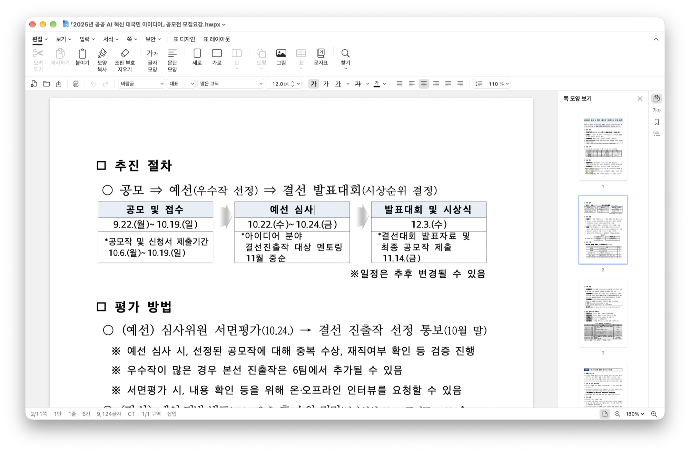

# Hwalja

Mac에서 한글 문서를 바로 열고 수정하는 네이티브 편집기.

- **익숙한 메뉴**: 메뉴와 대화 상자는 한글 2024의 구성을 기준으로 합니다.
- **빠른 편집**: 용량이 큰 문서에서도 안정적으로 편집이 가능합니다.

## 설치

macOS 14 이상. 아직 정식 버전이 출시되지 않았습니다. ~[Releases](https://github.com/kimroen121/HwpStudio/releases)에서 `hwalja.zip`로 설치할 수 있습니다~

직접 빌드하거나 기여하려면 [CONTRIBUTING.md](CONTRIBUTING.md)를 확인하세요.

## 알아 두기

- 글꼴은 Mac에 설치된 글꼴을 사용합니다. 
- 지원하는 기능과 진행 상황은 [docs/FEATURES.md](docs/FEATURES.md)에서 확인할 수 있습니다.

## 라이선스

[MIT](LICENSE)

조판 엔진으로 [rhwp](https://github.com/edwardkim/rhwp)(MIT)를 사용합니다. 함께 배포되는 오픈 소스 관련 고지는 앱 내부 `ThirdPartyNotices.txt`에 포함되어 있습니다.

본 제품은 한글과컴퓨터의 한글 문서 파일(.hwp) 공개 문서를 참고하여 개발하였습니다. 한글, 한컴오피스는 한글과컴퓨터의 상표이며, Hwalja는 한글과컴퓨터와 관련이 없습니다.
